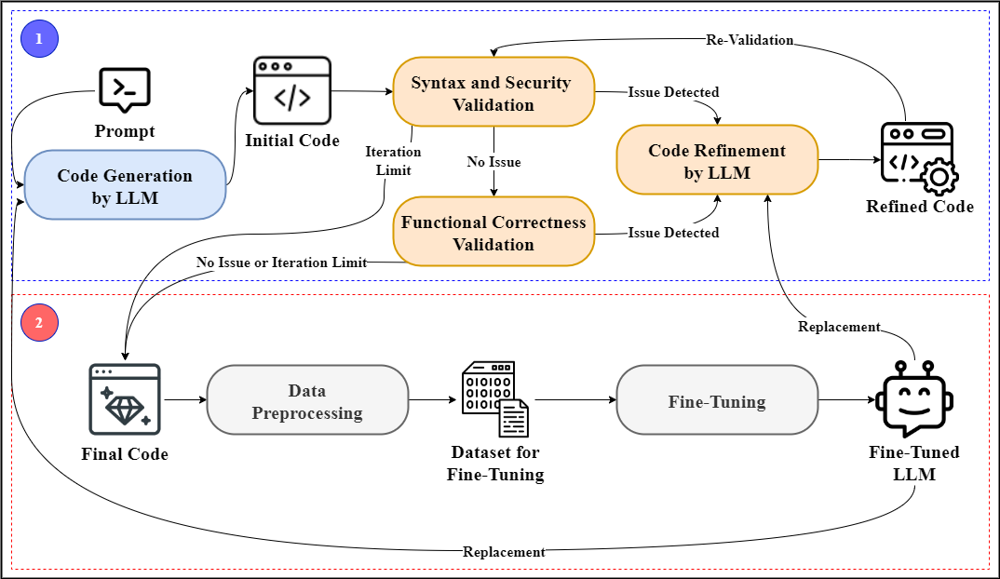

###CodeEnhancer: LLM-Generated Python Code Enhancement Through SAST Integration and Fine-Tuning

CodeEnhancer is a framework for improving the security and quality of Python code generated by Large Language Models (LLMs). For this purpose, the framework leverages Static Application Security Testing (SAST) tools in an iterative refinement process that uses LLM-based self-correction and targeted fine-tuning. CodeEnhancer is being developed by the [Cybersecurity Research Lab](https://www.jaist.ac.jp/is/labs/beuran-lab/) at Japan Advanced Institute of Science and Technology ([JAIST](https://www.jaist.ac.jp/english/)), Ishikawa, Japan.

The key features of CodeEnhancer are:

- **Two-stage framework:** Integrates automated code validation (using SAST tools and LLM feedback) with targeted LLM fine-tuning for robust Python code generation.
- **Iterative validation and feedback-driven refinement:** Repeatedly validates generated code for syntax errors via Pylint, security vulnerabilities via Bandit, and functional correctness (using LLM-based assessment), and uses automated feedback loops to guide the LLM in self-correcting errors until all checks are passed or a maximum attempt limit is reached.
- **Fine-tuning support**: Enables further improvement of LLM performance by fine-tuning models on validated, high-quality code samples.
- **Easy integration:** Supports both base and fine-tuned OpenAI models for code generation and refinement.
- **Reproducible experiments:** Structured logging and organized outputs for transparent, repeatable experiments.
- **Generalizable and extensible:** Designed to support a wide range of security-oriented code generation and validation tasks.


## Framework Overview

The following diagram summarizes the two-stage workflow of CodeEnhancer.
<p align="center">
  
</p>

### Stage 1 (blue frame in the figure)

1. **Code Generation by LLM**: Generate Python code from a natural language prompt.
2. **Syntax and Security Validation**: Use Pylint and Bandit to check for syntax errors and security vulnerabilities.
3. **Code Refinement by LLM**: If issues are found, prompt the LLM to refine the code.
4. **Functional Correctness Validation**: The LLM checks if the code behavior matches the intent.

This process iterates until all checks pass or a maximum attempt limit is reached.

### Stage 2 (red frame in the figure)

1. **Data Preprocessing**: Aggregates and cleans final validated code.
2. **Fine-Tuning**: Uses these code samples to further fine-tune the LLM.

The upgraded model can replace the base LLM for improved future code generation.


## Getting Started

### Prerequisites

* Python 3.9+
* [OpenAI Python SDK](https://github.com/openai/openai-python)
* [Pylint](https://pylint.org/)
* [Bandit](https://bandit.readthedocs.io/)

To install the required Python packages, run the commands below:

```bash
pip install openai tqdm
pip install pylint bandit
```

### Code Structure

This repository includes two main scripts:

* `code_generator.py`: Generates Python code for each prompt using your selected LLM. All generated code includes a structured docstring with `Input Prompt`, `Intention`, and `Functionality`.

* `code_validator.py`: Iteratively validates and refines generated code:
  - Syntax validation with Pylint
  - Security validation with Bandit
  - Functional correctness validation with LLM self-assessment
  - Automatic repair/refinement loop up to a configurable iterration limit

## Usage

1. **Prepare the input prompt dataset**
   - Create a JSON file (e.g., `dataset.json`) containing a list of prompts for code generation. Each entry should include at least an `"id"` and a `"prompt"` field. Example:
     ```json
     [
       {
         "id": "sample_001",
         "prompt": "Write a Python function that returns the maximum of two numbers."
       },
       {
         "id": "sample_002",
         "prompt": "Implement a function that checks if a string is a palindrome."
       }
     ]
     ```
   - Place `dataset.json` in the project root directory.

2. **Configure your environment and API key**
   - Open `code_generator.py` and `code_validator.py` and set your OpenAI API key by editing this line:
     ```python
     API_KEY = "YOUR_OPENAI_API_KEY"
     ```
   - You can also adjust paths and parameters such as `BASE_DIR`, `DATASET_PATH`, and the number of worker threads at the top of each script.

3. **Generate candidate code using `code_generator.py`**
   - Run the following command in your terminal:
     ```bash
     python code_generator.py
     ```
   - This will:
     - Read each prompt from `dataset.json`.
     - Generate a Python code file for each prompt using your specified LLM (default: OpenAI GPT-4o).
     - Save each generated code file as `<id>.py` in `./baseline/code/`.
     - Save a dialogue log (`<id>_dialogue.json`) for each generation in `./baseline/`.

4. **Validate and iteratively refine code using `code_validator.py`**
   - Run the following command in your terminal:
     ```bash
     python code_validator.py
     ```
   - This script will:
     - For each generated code file in `./baseline/code/`:
       - Check for syntax errors using **Pylint**.
       - Scan for security vulnerabilities using **Bandit**.
       - Assess functional correctness using an LLM-based self-assessment.
     - If any issues are found, the script will automatically prompt the LLM to revise the code, repeating this loop up to a configurable number of times (default: 5).
     - All refined code, validation results, and dialogue logs will be saved in the corresponding output folders (`./baseline/`).

5. **Review results and outputs**
   - After running both scripts, you will find:
     - Generated and refined code files in `./baseline/code/`
     - Dialogue logs in `./baseline/`
     - Validation summaries, including `results.json`, `all_dialogues.json`, and `missing_docstrings.txt` for tracking any code that failed validation

6. **(Optional) Use validated code for LLM fine-tuning**
   - The high-quality, validated code samples can be used to further fine-tune your own LLMs. Export or preprocess the `.py` files as needed for your training pipeline.

### Example Project Directory Structure
```
project-root/
├── code_generator.py
├── code_validator.py
├── dataset.json
├── baseline/
│   ├── code/
│   │   ├── sample_001.py
│   │   ├── sample_002.py
│   ├── sample_001_dialogue.json
│   ├── sample_002_dialogue.json
│   ├── results.json
│   ├── all_dialogues.json
│   └── missing_docstrings.txt
├── README.md
├── framework_overview.png
└── ...
```


### Notes

- All code and outputs are saved relative to the script location (or as set in `BASE_DIR`).
- All validation and revision steps are fully automated; the process continues until all checks pass or the maximum retry limit is reached.
- For large datasets, you can adjust parallel processing parameters (`MAX_WORKERS`) in the scripts for faster execution.
- All scripts and logs use UTF-8 encoding for compatibility.


## Citation

This code is not yet associated with a published paper. If you find it useful for research or teaching, please cite the GitHub repository directly:

```
@misc{CodeEnhancer2025,
  author = {{Cybersecurity Research Lab}},
  title = {{CodeEnhancer}: {LLM}-Generated Python Code Enhancement Through SAST Integration and Fine-Tuning},
  year = {2025},
  howpublished = {\url{https://github.com/cyb3rlab/CodeEnhancer}}
}
```


## References

For the list of contributors, please check the file CONTRIBUTORS.

