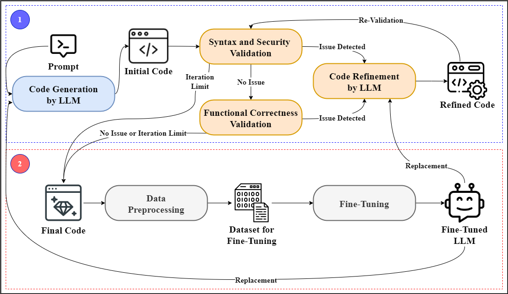

# CodeEnhance: LLM-Generated Python Code Enhacement Thorugh SAST Integration and Fine-Tuning


## Overview

**CodeEnhance** is an open-source framework for systematically improving the **security** and **quality** of Python code generated by Large Language Models (LLMs).\
The framework automates static analysis (using Pylint and Bandit) and enables iterative refinement through LLM-based self-correction and targeted fine-tuning.

Key features include:

- **Automated multi-stage validation**: Syntax, security, and functional correctness checks
- **Self-refinement pipeline**: Uses LLMs to automatically fix detected issues
- **Fine-tuning**: Upgrades base LLMs using validated and refined code
- **Extensive experiment & evaluation support**

---

## Framework Architecture

The following diagram summarizes the two-stage CodeEnhance workflow:
<p align="center">
  
</p>

- **Stage 1 (Blue)**:

  1. **Code Generation by LLM**: Generate Python code from a natural language prompt.
  2. **Syntax and Security Validation**: Use Pylint and Bandit to check for syntax errors and security vulnerabilities.
  3. **Code Refinement by LLM**: If issues are found, prompt the LLM to refine the code.
  4. **Functional Correctness Validation**: The LLM checks if the code behavior matches the intent.
  5. This process iterates until all checks pass or a maximum attempt limit is reached.

- **Stage 2 (Red)**:

  1. **Data Preprocessing**: Aggregates and cleans final validated code.
  2. **Fine-Tuning**: Uses these code samples to further fine-tune the LLM.
  3. The upgraded model can replace the base LLM for improved future code generation.

---

## Features

- **Multi-stage validation pipeline** (syntax, security, functionality)
- **Automated LLM feedback loop** for iterative refinement
- **Easy integration** with OpenAI models (supports base and fine-tuned LLMs)
- **Reproducible experiments** with structured logging and output organization

---

## Getting Started

### 1. Requirements

- Python 3.9+
- [OpenAI Python SDK](https://github.com/openai/openai-python)
- [Pylint](https://pylint.org/)
- [Bandit](https://bandit.readthedocs.io/)

Install required Python packages:

```bash
pip install openai tqdm
pip install pylint bandit
```

### 2. Code Structure

This repository includes two main scripts:

- `Code Generator.py` 
  Generates Python code for each prompt using your selected LLM.\
  All generated code includes a structured docstring with `Input Prompt`, `Intention`, and `Functionality`.

- `Code Validator.py` 
  Iteratively validates and refines generated code:

  - Syntax validation with Pylint
  - Security validation with Bandit
  - Functional correctness validation with LLM self-assessment
  - Automatic repair/refinement loop up to a configurable attempt limit

---

## Usage

**Step 1:** Edit user configuration in each script (API key, directories, etc.)\
**Step 2:** Run `Code Generator.py` to generate candidate code files.\
**Step 3:** Run `Code Validator.py` to validate and iteratively refine all generated code.\
**Step 4:** Optionally, use processed code as a dataset for LLM fine-tuning.

Example (Linux/macOS):

```bash
python Code\ Generator.py
python Code\ Validator.py
```

*(Modify paths in the scripts as needed.)*

---

## Directory Layout

```
.
├── Code Generator.py        # Script for LLM-based code generation
├── Code Validator.py        # Script for iterative code validation & refinement
├── framework_overall.png    # Main framework architecture diagram
```

---

## Acknowledgements

- This work builds on open-source tools such as [OpenAI Python SDK](https://github.com/openai/openai-python), [Pylint](https://pylint.org/), and [Bandit](https://bandit.readthedocs.io/).
- The project is inspired by the need for **secure, reliable, and explainable code generation** for Python LLM workflows.

---

## License

This code is released under the MIT License.\
Please see the `LICENSE` file for details.

---

## Citation

This code is **not yet associated with a published paper**.\
If you find it useful for research or teaching, please cite the GitHub repository directly:

```
@misc{codeenhance2025,
  author = {Jongmin Lee, Khang Mai, Nakul Ghate, Tomihiko Yagyu, Razvan Beuran and Yasuo Tan},
  title = {CodeEnhance: LLM-Generated Python Code Enhacement Thorugh SAST Integration and Fine-Tuning},
  year = {2025},
  howpublished = {\url{https://github.com/your-org/CodeEnhance}}
}
```

---

## Contact
For inquiries, please use the Issues tab on GitHub.
---

